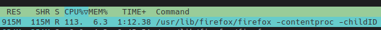
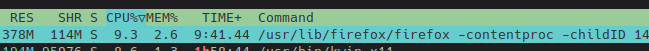

# Fix Canvas CPU

Beware: This is not a proper fix, however it seems to work without breaking anything else. If Canvas functionality stops working (especially third party widgets), try disabling this extension.

Before:

After:

